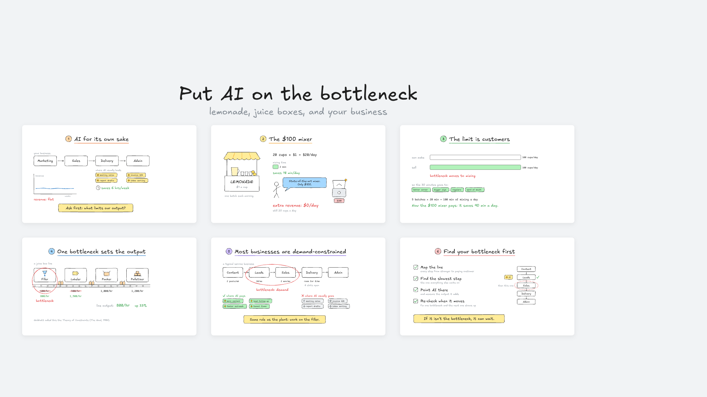
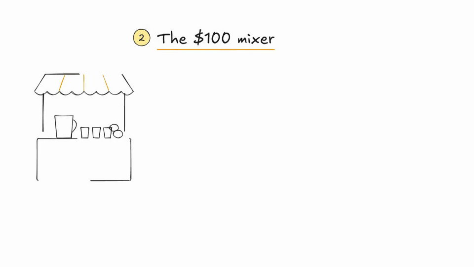

# Sketch Deck

Hand-drawn animated decks for talking-head videos. You write each part of the talk as a few lines of JavaScript, open the deck in Chrome, and press → as you talk. Each press builds the next piece of the diagram: text types itself out while boxes, arrows and bars draw themselves in. Because you record your screen and camera at the same time, each drawing appears on the sentence it belongs to and there's nothing to sync in the edit.



**[Try the demo](https://joshw-dev.github.io/sketch-deck/videos/ai-bottleneck/?demo)** (press → or tap to step through)



## How a video runs

- The deck opens on a board that shows every part of the talk. Parts you haven't reached yet are blurred.
- → zooms into the next part, which builds in about five steps, one per beat of what you're saying.
- After the last step, → zooms back out to the board and the finished part comes into focus.
- The right edge of every slide stays empty so your camera can sit there.

## Quick start

```bash
git clone https://github.com/JoshW-dev/sketch-deck
cd sketch-deck
open -a "Google Chrome" videos/ai-bottleneck/index.html
```

There's no build step. The fonts and rough.js live in `engine/`, so a plain file open works offline.

## Make a new video

```bash
npm run new -- my-topic "My topic in one line"
```

That creates `videos/my-topic/` with `index.html`, `content.js` and `outline.md`. Write the outline first: one sentence for the point, then four to six parts of about 50 seconds each. Then write each part in `content.js`. `CLAUDE.md` has the layout rules if a coding agent is writing the parts for you.

## Writing a part

```js
{
  title: 'The $100 mixer', color: 'yellow', max: 5,
  notes: ['what you say as the part opens', 'cue for step 1', 'cue for step 2' /* ... */],
  build(b) {
    b.at(1);                                   // everything below appears on step 1
    b.rect(130, 340, 250, 110, { fill: '#fff' });
    b.text(255, 406, 'Sales', { anchor: 'middle', size: 36 });

    b.at(2);
    b.bar(680, 438, 600, 44, { fill: PAL.orange[1], until: 4 });  // hidden from step 4 on

    b.at(4);
    b.bar(680, 438, 60, 44, { fill: PAL.green[1], from: 600 });   // shrinks from 600 to 60
  },
}
```

- **Shapes:** `rect`, `ellipse`, `line`, `arrow`, `curveArrow`, `lpath`, `poly`, `path`, `text`, `bar`, `check`, `cross`.
- **Ready-made pieces:** `tag`, `bubble`, `callout`, `doc`, `clock`, `person`, `sparkle`.
- **`b.group(() => { ... })`** reveals several shapes as one unit.
- **Timing options:** `until` (step it disappears on), `delay` (ms after the key press), and `anim`, which is one of `draw`, `type`, `pop`, `fade`, `grow` or `none`.
- **Style options:** `fill`, `stroke`, `sw` (stroke width), `rough`, `dash`, `size`, `color`, `mono`, `anchor`.
- **Palette:** `PAL.orange`, `yellow`, `green`, `blue`, `purple`, `red` and `teal`, each as `[ink, pastel fill]`.

The canvas is 1920x1080. Keep content left of x 1540.

## Keys

| Key | What it does |
|---|---|
| → or space | Next step. After the last step it goes back to the board, then into the next part |
| ← | Back one step |
| B | Board, or back into the current part |
| 1 to 9, 0 | Jump to a part, or to the board |
| F | Full screen |
| P | Presenter window with your notes for each step. Keys typed there drive the deck |
| H | Hide the step counter |
| G | Show where the camera box goes |
| R | Restart from the board |
| ? | Help |

A reload keeps your place. Add `?demo` to the URL for on-screen arrows, and on a phone you can tap to step.

## Recording

1. Press F to go full screen. If you have a second screen, press P and drag the notes window onto it.
2. Record with a tool that saves screen and camera as separate tracks, so you can place the camera in the edit. Loom works too: press G and put its bubble inside the dashed box.
3. Record one part per take.

## Screenshots and GIFs

```bash
npm install
npm run shots -- ai-bottleneck --gif 2
```

This renders the board, every part, and a GIF of one part building, using the Chrome you already have. Files land in `docs/screenshots/<slug>/`.

## What's where

```
engine/      deck.js (drawing, animation, navigation), deck.css, rough.js, fonts
videos/      one folder per video: index.html, content.js, outline.md
templates/   the starting point for npm run new
scripts/     new-video.mjs and shots.mjs
docs/        screenshots
```

## Credits

I worked out the format by taking apart one of Nick Saraev's Claude Code videos frame by frame. The fonts are Excalidraw's Excalifont (SIL Open Font License 1.1) and Comic Shanns (MIT), and the sketchy strokes come from [rough.js](https://roughjs.com) (MIT).

The code is MIT licensed. The fonts keep their own licenses, which are in `engine/fonts/`.
